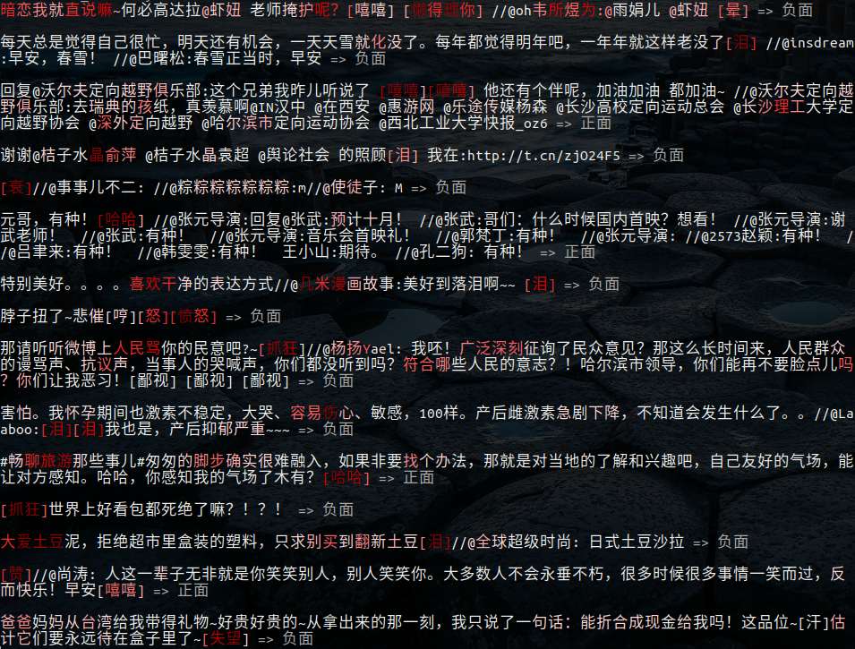
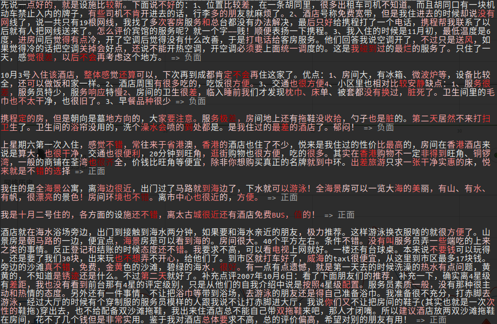

# text-integrated-gradients

在[text-globalmaxpool-visualization](https://github.com/allenwind/text-globalmaxpool-visualization)和[text-attentionpooling-visualization](https://github.com/allenwind/text-attentionpooling-visualization)中分别使用GlobalMaxPooling和AttentionPooling在文本分类和匹配中进行可视化的分析和理解。结论是这两种方法都可以有效地捕捉文本中的关键信息。比起AttentionPooling在计算文本中字词的重要性权重的直观性，GlobalMaxPooling则在直觉上较难理解，在通过可视化分析后，发现Pooling后的句向量的每个元素对应着某个词向量的最大值，而该值可以作为词的重要性权重。类似的实验下，最小方差组合的句向量也能获得差不多的效果，但是GlobalAveragePooling则没有这种性质，它更像是句向量序列求平均后，依赖下游网络的拟合能力来弥补Pooling方法无法很好获取句子中关键信息的缺陷，以便获得不错的预测效果。

然而，以上方法及其相关改进都是“入侵式”，即为了获得上述可视化效果，模型上强迫你使用GlobalMaxPooling和AttentionPooling等组件。[integrated-gradients](https://arxiv.org/abs/1703.01365)则是一种比较通用的可视化方法来理解神经网络在具体任务上的表现。

## 可视化示例

下面是文本分类任务的积分梯度可视化，文字颜色越红越深字权重越大。

### 梯度可视化效果

作为对比，我们先看看纯梯度的效果。

新闻分类示例，

正负情感分类，

酒店评价分类，

四情感分类，

### 积分梯度可视化效果

新闻分类示例，

正负情感分类，

酒店评价分类，

四情感分类，

可以看到，相较于直接使用梯度，积分梯度定位文本的关键信息更准确。尤其是对于正负情感分类示例，两者差别更明显。

## 参考和数据来源

[1] http://thuctc.thunlp.org/

[2] https://github.com/SophonPlus/ChineseNlpCorpus/blob/master/datasets/weibo_senti_100k/intro.ipynb

[3] https://github.com/SophonPlus/ChineseNlpCorpus/blob/master/datasets/simplifyweibo_4_moods/intro.ipynb

[4] https://www.aclweb.org/anthology/C18-1166/

[5] https://arxiv.org/abs/1703.01365

[6] https://tensorflow.google.cn/tutorials/interpretability/integrated_gradients?hl=en

